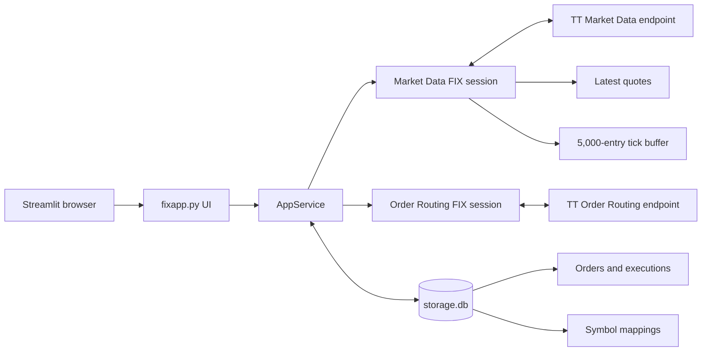

# TT FIX Trading Terminal

## Project overview

This project provides both a native PySide6 desktop terminal and the original
Streamlit operator terminal for connecting to Trading Technologies (TT) using
FIX 4.2. It provides separate Market Data and Order
Routing sessions, instrument lookup, market-data subscriptions, a live tick
tape, order entry, cancel/replace controls, execution history, FIX logs, symbol
mapping, and local diagnostics.

The application is designed primarily for TT UAT and certification work. Real
order submission is disabled by default and must be enabled explicitly.

## Main capabilities

- Separate TT FIX 4.2 sessions for Market Data and Order Routing.
- Built-in Python FIX client on systems where QuickFIX is unavailable.
- Optional QuickFIX engine when the `quickfix` Python package is installed.
- Explicit connect, disconnect, and reconnect controls.
- TT Security Definition lookup and exact Security ID selection.
- Full-book or top-of-book market-data requests.
- Snapshot-only or snapshot-plus-update subscriptions.
- Latest bid, ask, trade price, size, and receive timestamp.
- Real-time tick tape with a 100 ms display-refresh interval.
- Capture of snapshot, new, change, and delete market-data entries.
- Manual **Refresh table** control for the live market-data fragment.
- Symbol bridge between an external/maker symbol and a TT instrument.
- Order review and explicit confirmation before transmission.
- Market, limit, stop, and stop-limit orders.
- Day, GTC, IOC, FOK, and GTD time-in-force values.
- Cancel and replace requests for open orders.
- SQLite persistence for orders, executions, and symbol mappings.
- Filterable and downloadable FIX message log with passwords masked.
- Mock mode for UI and workflow testing without sending real messages.
- Local certification-readiness checks and evidence export.

## Architecture



`AppService` owns the two FIX sessions and shared runtime state. The service is
stored in Streamlit Session State so normal UI reruns do not create duplicate
TT connections. Background FIX threads receive messages while thread-safe
snapshots are rendered by Streamlit.

## Project files

| Path | Purpose |
|---|---|
| `fixapp.py` | Main application, FIX clients, data models, persistence, and UI |
| `desktop_app.py` | Recommended event-driven PySide6 desktop interface |
| `ttfix_core.py` | Streamlit-independent FIX, market-data, order, and SQLite service |
| `run_desktop.bat` | Double-clickable Windows launcher (recommended) |
| `run_desktop.ps1` | PowerShell launcher for the desktop application |
| `requirements.txt` | Required Python dependency list |
| `.streamlit/secrets.toml.example` | Safe configuration template |
| `.streamlit/secrets.toml` | Local credentials and runtime settings; do not commit |
| `storage.db` | SQLite database created and updated by the application |
| `MARKET_DATA_POSITION.md` | Detailed explanation of FIX tag 290/book position |
| `backup_v1fixapp.py` | Older backup of the application |
| `quickfix-1.16.0/` | Extracted QuickFIX source tree |
| `quickfix-1.16.0.tar.gz` | QuickFIX source archive |
| `vendor/` | Vendored QuickFIX source/build material |
| `quickfix-build*.log` | Previous QuickFIX build output; ignored by Git |
| `_ttfix_repo_review/` | Separate review/reference material, not the main app |

## Requirements

- Windows, Linux, or macOS with Python 3.10 or newer.
- Streamlit 1.40 or newer.
- Network access to the TT-provisioned FIX endpoints.
- Valid TT FIX credentials and CompIDs for real mode.
- QuickFIX is optional because the application includes a native Python FIX
  4.2 client.

The committed requirements currently contain:

```text
streamlit>=1.40
PySide6-Essentials>=6.7
```

## Installation

### Windows PowerShell

```powershell
py -3.11 -m venv .venv
.venv\Scripts\Activate.ps1
python -m pip install --upgrade pip
python -m pip install -r requirements.txt
```

If PowerShell blocks environment activation, run the environment's interpreter
directly:

```powershell
.venv\Scripts\python.exe -m pip install -r requirements.txt
.venv\Scripts\python.exe -m streamlit run fixapp.py --server.port 8502
```

### Linux or macOS

```bash
python3 -m venv .venv
source .venv/bin/activate
python -m pip install --upgrade pip
python -m pip install -r requirements.txt
```

## Configuration

Copy the template before running in real mode:

```powershell
Copy-Item .streamlit\secrets.toml.example .streamlit\secrets.toml
```

Configuration values are read from `.streamlit/secrets.toml`. Each value can
also be supplied through an environment variable named as
`SECTION_KEY`, converted to uppercase. For example,
`[fix_order].password` maps to `FIX_ORDER_PASSWORD`.

```toml
[application]
environment = "UAT"
mock_mode = false
enable_live_order_submission = false

[fix_order]
host = "fixorderrouting-ext-uat-cert.trade.tt"
port = 11502
sender_comp_id = "YOUR_ORDER_COMP_ID"
target_comp_id = "TT"
sender_sub_id = ""
on_behalf_of_sub_id = "YOUR_PROVISIONED_VALUE"
password = "YOUR_LOCAL_SECRET"
account = "YOUR_ACCOUNT"

[fix_market_data]
host = "fixmarketdata-ext-uat-cert.trade.tt"
port = 11503
sender_comp_id = "YOUR_MARKET_DATA_COMP_ID"
target_comp_id = "TT"
sender_sub_id = ""
on_behalf_of_sub_id = "YOUR_PROVISIONED_VALUE"
password = "YOUR_LOCAL_SECRET"
```

Only use the host, ports, IDs, account, and tag 116 value provisioned by TT.
The example UAT values in the application are defaults, not a substitute for
the settings assigned to a specific customer.

### Application settings

| Setting | Default | Meaning |
|---|---|---|
| `environment` | `UAT` | Environment label displayed by the terminal |
| `mock_mode` | `false` | Enables simulated sessions, ticks, acknowledgements, and fills |
| `enable_live_order_submission` | `false` | Required before non-mock orders can be transmitted |

### FIX session settings

| Setting | Meaning |
|---|---|
| `host` / `port` | TT connection endpoint |
| `sender_comp_id` | This client's FIX SenderCompID, tag 49 |
| `target_comp_id` | TT's FIX TargetCompID, tag 56 |
| `sender_sub_id` | Optional SenderSubID, tag 50 |
| `on_behalf_of_sub_id` | Optional provisioned value for tag 116 |
| `password` | Sent in RawData, tag 96, during logon |
| `account` | Default order account; Order Routing only |

## Running the application

### Native desktop application (recommended for live data)

```powershell
.\run_desktop.bat
```

Alternatively:

```powershell
.venv\Scripts\python.exe desktop_app.py
```

The desktop interface is event-driven. Each incoming FIX market-data message
is delivered to Qt as one batch and updates the native table model directly.
It does not use browser transport, periodic Streamlit reruns, or dataframe
serialization. This is the recommended entry point for high-rate live ticks.

### Original Streamlit application

```powershell
streamlit run fixapp.py --server.port 8502
```

For Streamlit, open `http://localhost:8502` in a browser. The desktop app opens
its own native window and does not use a localhost port.

The application does not automatically connect real FIX sessions. Open **FIX
Connectivity** and connect Market Data and Order Routing explicitly. TT normally
allows only one active connection for a given FIX session/CompID. Do not start a
second client with the same CompID.

## Recommended first run

1. Set `mock_mode = true` and keep live order submission disabled.
2. Start the Streamlit app.
3. Confirm both mock sessions show `CONNECTED`.
4. Subscribe to one of the mock symbols: `EURUSD`, `XAUUSD`, or `ES`.
5. Verify the latest quote and tick tape update.
6. Submit and review a mock order.
7. Check Open Orders, Executions, and the FIX Message Log.
8. Return to real UAT only after the UI workflow is understood.

## UI pages

### Dashboard

Shows counts for open orders, total orders, filled quantity, and captured FIX
messages. It also displays the current market-data records and recent FIX log
entries.

### FIX Connectivity

Controls the Market Data and Order Routing sessions independently. For each
session it displays:

- Connection status.
- SenderCompID and TargetCompID.
- Last heartbeat and last FIX message time.
- Incoming and outgoing message counts.
- Incoming and outgoing sequence numbers.
- Socket, session, or logon errors.

Use **Disconnect** before changing session configuration. After a reconnect,
wait for TT to release the previous session before pressing **Connect** again.

### Instrument Lookup

Sends a Security Definition Request and stores returned definitions in memory.
Search narrowly by exchange, security type, product symbol, and optionally the
contract month. A returned instrument can be transferred directly to Market
Data or Order Entry, including its exact TT Security ID.

Broad catalogue requests can return a large number of messages and should only
be used when TT has approved that request volume.

### Symbol Bridge

Maps a local or maker-facing symbol to TT fields:

- Bridge symbol.
- Maker/feed name.
- Maker symbol.
- TT symbol.
- TT exchange.
- TT Security ID.
- Security type.
- Display precision.
- Enabled state.

Mappings are stored in SQLite. This page only performs local translation; it
does not connect to an external maker or price feed.

### Market Data

Creates and cancels TT Market Data Request (`35=V`) subscriptions. Instruments
can be identified by TT Security ID or by symbol, exchange, security type, and
contract month.

Market-data choices:

| UI option | FIX behavior |
|---|---|
| `FULL_BOOK` | Tag 264 is `0`, requesting available market depth |
| `TOP_OF_BOOK` | Tag 264 is `1`, requesting one level |
| `SNAPSHOT` | Tag 263 is `0`; TT sends a one-time response |
| `SNAPSHOT_PLUS_UPDATES` | Tag 263 is `1`, with tag 265 set for incremental updates |

The request asks for bids (`269=0`), asks (`269=1`), and trades (`269=2`) and
sets AggregatedBook (`266=Y`).

#### Latest quote table

| Column | Meaning |
|---|---|
| `symbol` | TT product/instrument symbol |
| `bid` / `bid_size` | Latest processed bid price and quantity |
| `ask` / `ask_size` | Latest processed ask price and quantity |
| `last` / `last_size` | Latest processed trade price and quantity |
| `timestamp` | UTC time when the application processed the entry |

#### Real-time tick tape

The FIX receiver processes messages as they arrive. Streamlit redraws the live
fragment every 100 milliseconds, or immediately when **Refresh table** is
pressed. The visible table shows the newest 250 entries; a bounded deque retains
the newest 5,000 entries in memory.

| Column | Meaning |
|---|---|
| `received_at` | Application receive time in UTC with millisecond precision |
| `exchange_time` | Tag 273 when present; otherwise FIX SendingTime, tag 52 |
| `sequence` | FIX message sequence number, tag 34 |
| `symbol` | Instrument symbol |
| `update` | `SNAPSHOT`, `NEW`, `CHANGE`, or `DELETE` |
| `entry_type` | Usually `BID`, `ASK`, or `TRADE` |
| `price` | Market-data price, tag 270 |
| `size` | Market-data quantity, tag 271 |
| `entry_id` | Market-data entry ID, tag 278, when supplied |
| `position` | Book level relative to the best price, tag 290 |

Position `1` is the best level on that side, `2` is the second-best level, and
so on. Bid and ask ladders have independent positions. See
[`MARKET_DATA_POSITION.md`](MARKET_DATA_POSITION.md) for delete/change examples
and TT's incremental-position rule.

### Order Entry

Builds a New Order Single (`35=D`). An order is first reviewed, validated, and
then requires explicit confirmation. The application validates session state,
quantity, account, price requirements, instrument identity, ClOrdID uniqueness,
and the live-order safety flag.

| UI value | FIX value |
|---|---|
| BUY / SELL | Side tag 54: `1` / `2` |
| MARKET | OrdType tag 40: `1` |
| LIMIT | OrdType tag 40: `2` |
| STOP | OrdType tag 40: `3` |
| STOP_LIMIT | OrdType tag 40: `4` |
| DAY / GTC / IOC / FOK / GTD | TimeInForce tag 59: `0` / `1` / `3` / `4` / `6` |

Orders are persisted before socket transmission so a fast Execution Report can
always be correlated with the local ClOrdID.

### Open Orders

Shows orders in `PENDING`, `NEW`, or `PARTIALLY_FILLED` state. Operators can send
Order Cancel Request (`35=F`) and Order Cancel/Replace Request (`35=G`) messages.
The displayed state changes authoritatively when TT sends an Execution Report.

### Executions

Displays execution records saved from correlated Execution Reports (`35=8`).
The table is read from SQLite and sorted newest first.

### FIX Message Log

Shows up to the latest 500 filtered messages. Filters include session,
direction, and message type. The filtered log can be downloaded as TSV. RawData
password values in tag 96 are replaced with `****` before messages enter the UI
log.

### Settings

Displays the resolved configuration as read-only JSON. Passwords are masked. To
change settings, edit `.streamlit/secrets.toml` and reload the application.

### Certification / Diagnostics

Performs local checks for configuration, connectivity, logons, heartbeats,
orders, and executions. Results can be downloaded as TSV evidence. These local
checks do not constitute TT certification.

## FIX message coverage

### Session-level behavior

- Logon (`35=A`) with password in tags 95/96 and reset flag 141.
- Heartbeat (`35=0`) generation during idle periods.
- Test Request (`35=1`) response with matching tag 112.
- Logout (`35=5`) on operator disconnect where possible.
- Tracking of message counts, timestamps, and sequence values.

### Market Data

- Outbound Market Data Request (`35=V`).
- Inbound Snapshot/Full Refresh (`35=W`).
- Inbound Incremental Refresh (`35=X`).
- Inbound Market Data Request Reject (`35=Y`).
- Outbound Security Definition Request (`35=c`).
- Inbound Security Definition (`35=d`).

### Order Routing

- Outbound New Order Single (`35=D`).
- Inbound Execution Report (`35=8`).
- Outbound Order Cancel Request (`35=F`).
- Outbound Order Cancel/Replace Request (`35=G`).

## Persistence

`storage.db` is a local SQLite database using three tables.

### `orders`

Stores ClOrdID, account, symbol, side, order type, quantity, price, TIF, current
status, TT Order ID, fill quantities, average price, rejection reason,
timestamps, and the latest raw Execution Report.

### `executions`

Stores execution ID, related order IDs, symbol, side, executed quantity and
price, execution type/status, timestamp, and raw FIX message.

### `symbol_mappings`

Stores the bridge symbol, maker fields, TT identifiers, price precision, enabled
state, and update time.

Database operations use a lock because FIX callbacks and Streamlit reruns can
access the same SQLite connection from different threads.

Market subscriptions, instrument definitions, FIX UI logs, latest quotes, and
the 5,000-entry tick buffer are memory-only and disappear when the application
process ends.

## Threading and refresh behavior

- Each native FIX session runs in a daemon background thread.
- Socket sends are serialized with a send lock.
- Session counters and status use per-session locks.
- Market-data records, subscriptions, rejections, and ticks use an `RLock`.
- SQLite writes use a database lock.
- The Market Data UI is isolated in a Streamlit fragment.
- FIX receive latency and UI redraw latency are different: the receiver records
  a tick immediately, while the browser normally sees it on the next 100 ms
  fragment refresh.

## Security and operational safety

- Never commit `.streamlit/secrets.toml`.
- Never place TT passwords directly in `fixapp.py` or documentation.
- Keep `enable_live_order_submission = false` until UAT validation is complete.
- Use exact TT Security IDs when possible to avoid ambiguous product symbols.
- Verify account, side, quantity, order type, contract, and price before confirm.
- Avoid duplicate logons using the same SenderCompID.
- Treat downloaded FIX logs and the SQLite database as sensitive trading data.
- Back up `storage.db` before manual schema changes.
- Use TT's official certification process before production use.

## Known limitations

- The native Python client implements the subset of FIX 4.2 used by this app; it
  is not a complete general-purpose FIX engine.
- The tick tape stores raw market-data events but the UI does not yet reconstruct
  and display a persistent multi-level order-book ladder from all incremental
  actions.
- The latest quote row depends on the latest processed BID/ASK/TRADE entries; it
  is not a substitute for a validated depth-book implementation.
- Only the latest 5,000 tick entries are retained, and they are not persisted.
- The browser redraw target is 100 ms, but OS scheduling, network latency,
  Streamlit processing, and browser rendering can make actual display latency
  higher.
- Snapshot subscriptions do not continue updating; use
  `SNAPSHOT_PLUS_UPDATES` for a live stream.
- Market data depends on TT permissions, exchange session state, and account
  entitlements.
- Local diagnostics are not proof of TT production certification.
- There is currently no automated test suite committed to the project.

## Validation and testing

### Syntax check

```powershell
python -m py_compile fixapp.py
```

### Streamlit application smoke test

```powershell
python -c "from streamlit.testing.v1 import AppTest; at=AppTest.from_file('fixapp.py').run(); print(list(at.exception))"
```

An empty exception list indicates that the initial Streamlit render completed.
It does not verify real TT connectivity.

### Manual UAT checklist

1. Confirm secrets resolve correctly on the Settings page.
2. Connect Market Data and confirm Logon and Heartbeat activity.
3. Perform a narrow instrument lookup.
4. Subscribe using the returned exact Security ID.
5. Confirm snapshots and updates appear in the tick tape.
6. Check FIX sequence values and timestamps.
7. Connect Order Routing.
8. Review and submit the agreed certification order cases.
9. Verify Execution Reports update order state.
10. Test cancel and replace flows.
11. Export FIX logs and local diagnostic evidence.
12. Disconnect both sessions cleanly.

## Troubleshooting

### Streamlit is missing from `.venv`

```powershell
.venv\Scripts\python.exe -m pip install -r requirements.txt
```

Run Streamlit with the same interpreter used for installation.

### Market Data shows connected but no prices

- Confirm the exact Security ID, exchange, security type, and contract month.
- Check for a Market Data Request Reject (`35=Y`).
- Confirm `SNAPSHOT_PLUS_UPDATES` was selected for continuous data.
- Verify the exchange is open and the instrument currently has a quote.
- Confirm the TT session has market-data entitlement for the instrument.
- Inspect the FIX Message Log for `35=W` or `35=X` messages.

### Tick tape stops changing

- Check that the Market Data session still shows `CONNECTED`.
- Compare the current incoming-message count with its prior value.
- Press **Refresh table** to force an immediate fragment redraw.
- Check whether only heartbeats are arriving.
- Inspect the session error and FIX log.

### Duplicate-session or already-logged-on error

TT generally permits one active client per provisioned FIX session. Disconnect
the other client or ask a TT administrator to reset the UAT session. Do not
repeatedly reconnect while the previous connection is still active.

### Socket access denied on Windows

Check firewall/endpoint-security rules, outbound access to the configured host
and port, and whether the process is running under an allowed user context.

### Order is not sent

- Confirm Order Routing is connected.
- Confirm `enable_live_order_submission = true` only when authorized.
- Check account, quantity, price, Security ID, exchange, type, and month.
- Ensure the ClOrdID is unique.
- Read the displayed error and corresponding outbound/inbound FIX log entries.

## Production-readiness work

Before treating this as a production trading system, consider adding:

- A fully tested incremental order-book reconstruction engine.
- FIX sequence-gap detection, resend handling, duplicate detection, and recovery.
- Persistent market-data capture if historical tick retention is required.
- Automated unit, parser, database, and end-to-end tests.
- Structured logs, rotation, monitoring, and alerting.
- Role-based authentication and authorization.
- Secrets management outside local files.
- Audit controls and immutable order-event history.
- Rate limits and fat-finger controls.
- Position, credit, and pre-trade risk checks.
- TLS/network architecture validated against the assigned TT connection setup.
- Graceful shutdown and recovery procedures.
- Formal TT certification and internal operational approval.

## References

- [TT FIX Help Library](https://library.tradingtechnologies.com/tt-fix/)
- [TT Market Data Request](https://library.tradingtechnologies.com/tt-fix/tt-fix-market-data/supported-application-messages-tt-fix-market-data/market-data-request-v-message/)
- [TT Market Data Snapshot](https://library.tradingtechnologies.com/tt-fix/tt-fix-market-data/supported-application-messages-tt-fix-market-data/market-data-snapshot-w-message/)
- [TT Market Data Incremental Refresh](https://library.tradingtechnologies.com/tt-fix/tt-fix-market-data/supported-application-messages-tt-fix-market-data/market-data-incremental-refresh-x-message/)
- [Streamlit documentation](https://docs.streamlit.io/)
